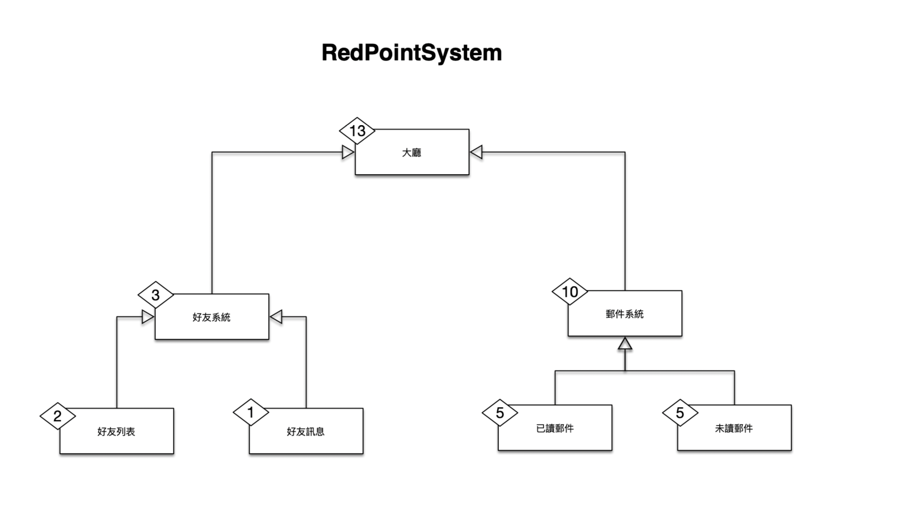
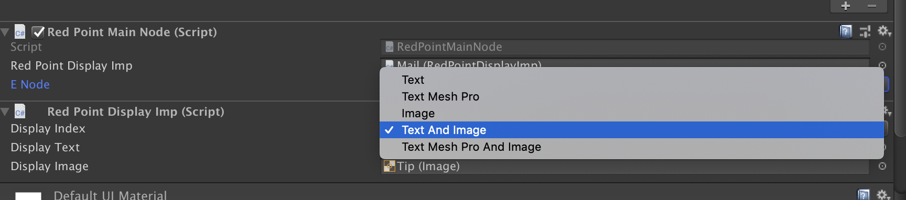
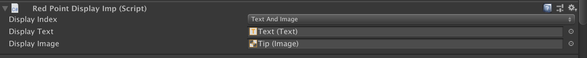
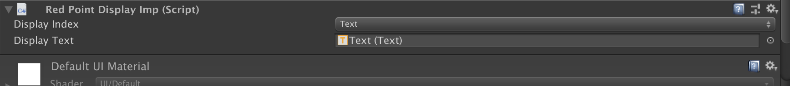
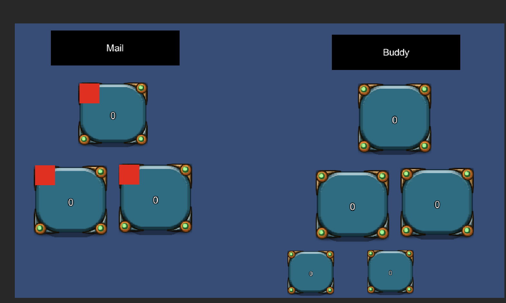
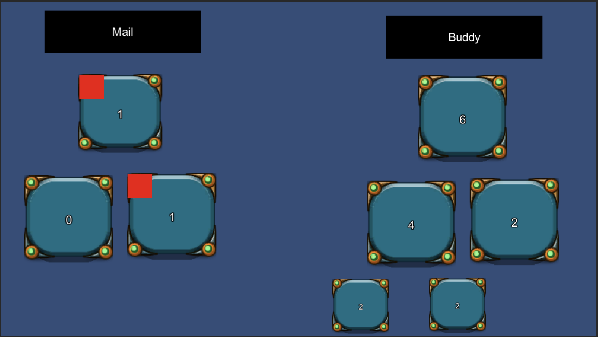

## RedPointSystem 



RedPointSystem 是在遊戲中常見的訊息提示系統，例如:未讀郵件、未領取獎勵...


## Features

使用遞迴進行節點的拜訪，且每一個節點的最尾端才會進行統計(也就是沒有子節點)，更新統計時也會依 Priority 進行更新。

## Version
Unity Version 2019.1.4f1

## How To Use
請參照 Example 內的範例。

1. 自訂 TreeMap implement IRedPointTreeMap 
2. 自訂 RedPointSystem extends RedPointSystemBase 並為此元件太上 TAG = "RedPointSystem" 在此物件身上
3. RedPointNodeAbstractNode: 紅點提示的抽像類別，可以 extends 進行改寫，如同 Example/Nodes。
## Example

RedPointSystem: 主要用來控制節點的建立與搜尋 

RedPointSystem::Notify 接收外部資料並通知每一個節點進行更新

RedPointTreeMap 此類別是用來定義管理遊戲中所有的題示節點的關係類別
```
                                          ERedPointMainNode(Mail, Buddy)
                                             /                      \
                ERedPointMailNode(Read, Unread)                     ERedPointBuddyNode(Message, Buddies)
                    /                       \                           /                           \
   ERedPointEmailNode(Read)     ERedPointEmailNode(Unread)    ERedPointMessageNode(Read,Unread)    ERedPointBuddyNode(Message,Buddies)
                                                                  /                         \
                                                  ERedPointMessageNode(Read)     ERedPointMessageNode(Unread)
```

RedPointDisplayImp 提供了以下五種顯示組合
* Text
* TextMeshPro
* Image
* Image and Text
* Image and TextMeshPro








## 演示結果

* before


* after 
